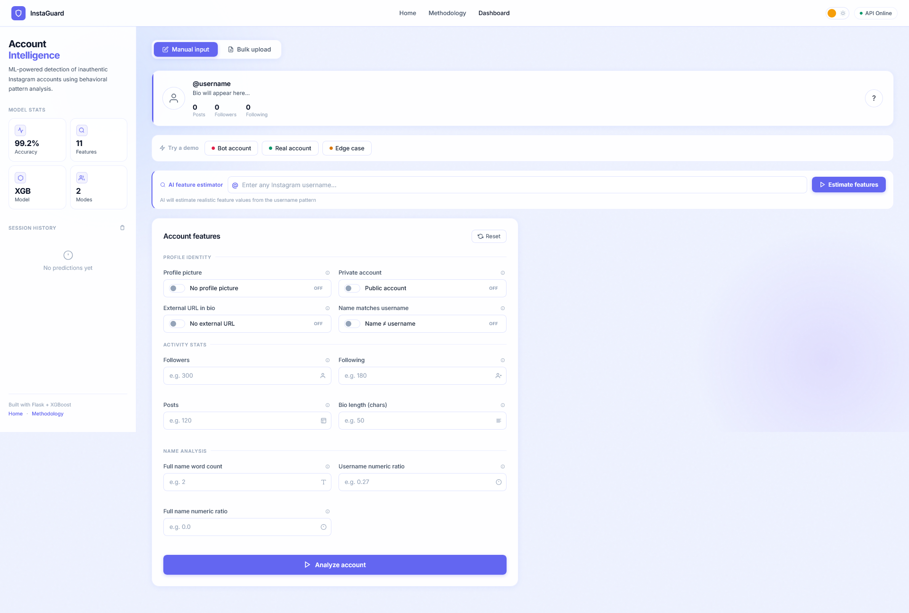
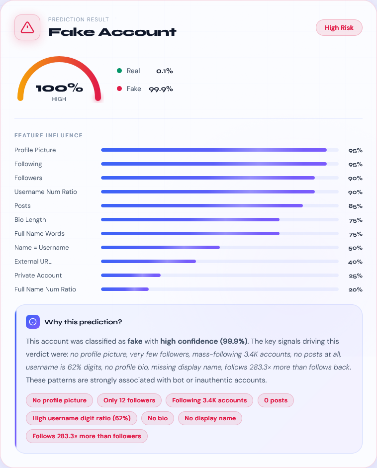
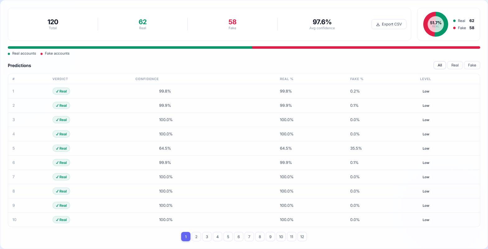
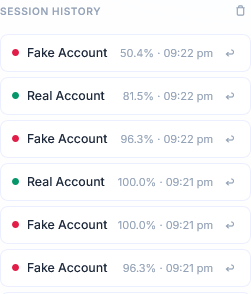

# 🛡️ InstaGuard — AI Fake Instagram Account Detection System

<p align="center">
  
  
  
  
  
</p>

<p align="center">
  <b>Detect fake Instagram accounts using machine learning and behavioral analysis</b><br/>
  Full-stack AI project with XGBoost, Flask, and an interactive dashboard
</p>

---

## 🔗 Live Demo

🌐 **Live:** https://insta-guard-pi.vercel.app/

⚙️ **Backend API:** https://instaguard-backend-2ldg.onrender.com/

📂 **Repository:** https://github.com/Aakarsh85/InstaGuard

---

## 🚀 Overview

InstaGuard is an end-to-end **machine learning system** that classifies Instagram accounts as **Real** or **Fake** using behavioral and profile-based features.

It combines:

* 🧠 **XGBoost ML model (tuned using GridSearchCV)**
* ⚙️ **Flask backend API**
* 🎨 **Modern interactive frontend dashboard**

---

## 🎯 Why This Project Matters

Fake accounts are widely used for:

* Spam & scams
* Bot-driven engagement
* Fake followers

👉 InstaGuard solves this using **data-driven ML predictions** instead of manual checks.

---

## ✨ Key Features

### 🤖 Machine Learning

* XGBoost-based classification model
* Hyperparameter tuning using GridSearchCV
* Evaluated using:

  * Accuracy, Precision, Recall
  * F1 Score
  * ROC-AUC

---

### 🌐 Application Features

* 🎯 Real-time account prediction
* 📊 Confidence score + probability breakdown
* 🧠 Explainable AI (plain-English reasoning)
* 🧾 Session history + replay
* ⚡ Health monitoring endpoint

---

### 🎨 UI/UX Features

* Modern dashboard with animations
* Input validation + live preview
* Confidence gauge visualization
* Feature-based explanation system
* Dark / Light mode toggle

---

## 📸 Screenshots

<!-- > Add your images inside `screenshots/` -->

### 🔹 Dashboard



### 🔹 Prediction Result



### 🔹 Bulk Analysis



### 🔹 History / Analytics



---

## 🔄 Project Flow

```text
User Input
   ↓
Frontend Validation
   ↓
API Request (/predict)
   ↓
Flask Backend
   ↓
Data Preprocessing
   ↓
XGBoost Model Prediction
   ↓
Confidence + Probability Calculation
   ↓
Response to Frontend
   ↓
UI Visualization
```

---

## 🧠 Machine Learning Pipeline

* Dataset: Instagram fake profile dataset
* Target column: `fake`

### Workflow:

* Data cleaning & preprocessing
* Feature normalization
* Train-test split
* Hyperparameter tuning (GridSearchCV)
* Model training (XGBoost)
* Evaluation:

  * Accuracy
  * Precision
  * Recall
  * F1 Score
  * Confusion Matrix
  * ROC-AUC

---

## 📊 Features Used

The model uses profile-based behavioral features:

* Profile picture presence
* Username numeric ratio
* Full name structure
* Bio length
* External URL
* Account privacy
* Number of posts
* Followers count
* Following count

---

## 🛠️ Tech Stack

| Layer      | Technology            |
| ---------- | --------------------- |
| ML Model   | XGBoost               |
| Backend    | Flask, Gunicorn       |
| Data       | Pandas, NumPy         |
| Frontend   | HTML, CSS, JavaScript |
| Deployment | Render, Vercel        |

---

## 📁 Folder Structure

```text
InstaGuard/
├── backend/
│   └── app.py
├── frontend/
│   ├── index.html
│   ├── script.js
│   └── style.css
├── model/
│   └── model.pkl
├── screenshots/
├── requirements.txt
├── runtime.txt
└── README.md
```

---

## ⚙️ Local Setup

### 1️⃣ Clone repository

```bash
git clone https://github.com/Aakarsh85/InstaGuard.git
cd InstaGuard
```

---

### 2️⃣ Setup backend

```bash
python -m venv venv
```

Activate:

```bash
# Windows
venv\Scripts\activate

# Mac/Linux
source venv/bin/activate
```

Install dependencies:

```bash
pip install -r requirements.txt
```

Run backend:

```bash
python backend/app.py
```

👉 Runs on: `http://localhost:10000`

---

### 3️⃣ Run frontend

```bash
cd frontend
python -m http.server 8080
```

👉 Open: `http://localhost:8080`

---

## 🔌 API Endpoints

### `GET /health`

```json
{
  "success": true,
  "status": "running",
  "model_loaded": true
}
```

---

### `POST /predict`

```json
{
  "profile pic": 1,
  "external URL": 0,
  "private": 0,
  "name==username": 0,
  "nums/length username": 0.22,
  "nums/length fullname": 0.10,
  "fullname words": 2,
  "description length": 58,
  "#posts": 120,
  "#followers": 4800,
  "#follows": 320
}
```

---

## 📈 Output Format

* Prediction → Real / Fake
* Confidence score
* Probability breakdown
* Risk level (Low / Medium / High)

---

## 🔮 Future Improvements

* SHAP-based explainability
* Database integration
* Authentication system
* Bulk CSV export
* Model performance dashboard

---

## 👨‍💻 Author

**Aakarsh Kumar**
GitHub: https://github.com/Aakarsh85

---

## ⭐ Support

If you like this project, give it a ⭐ on GitHub!

---

<p align="center">
  🚀 Built with passion for AI & Full Stack Development
</p>
